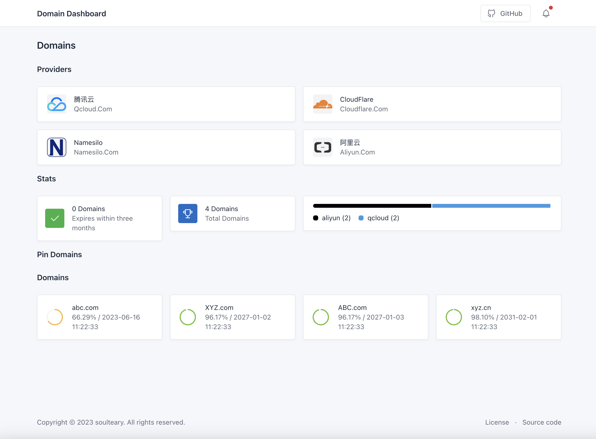
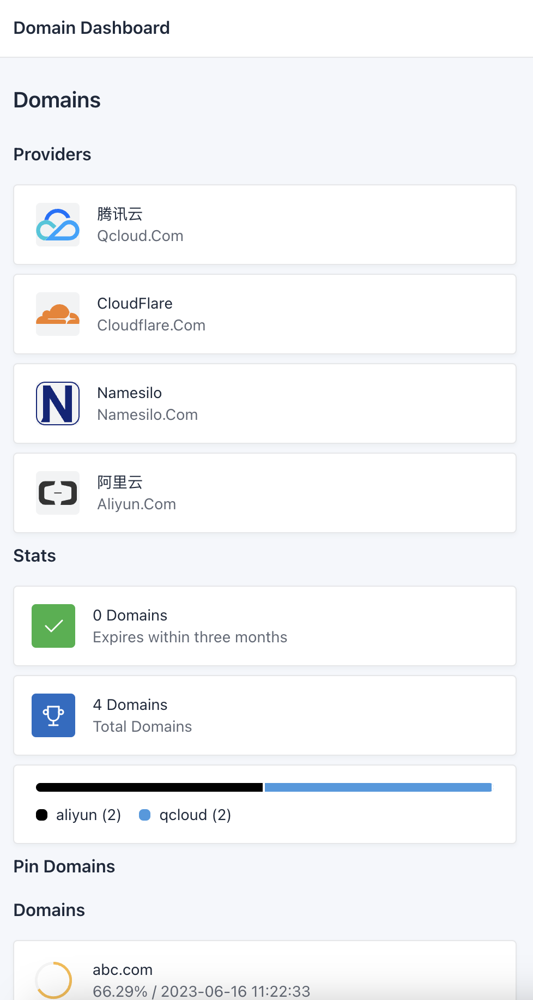
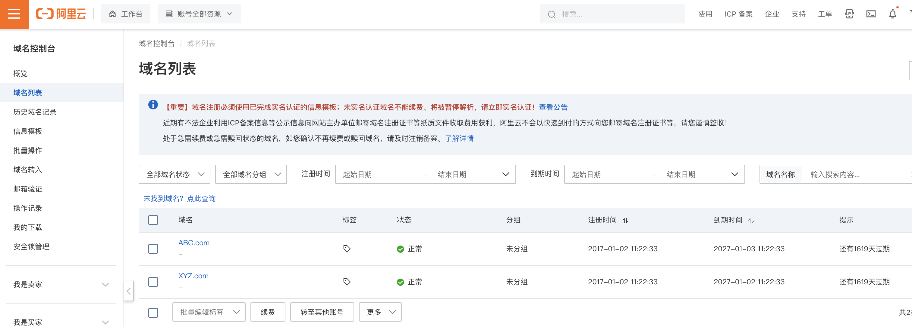
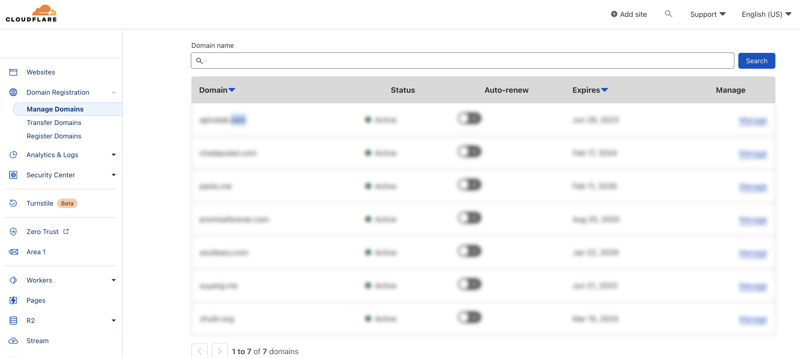
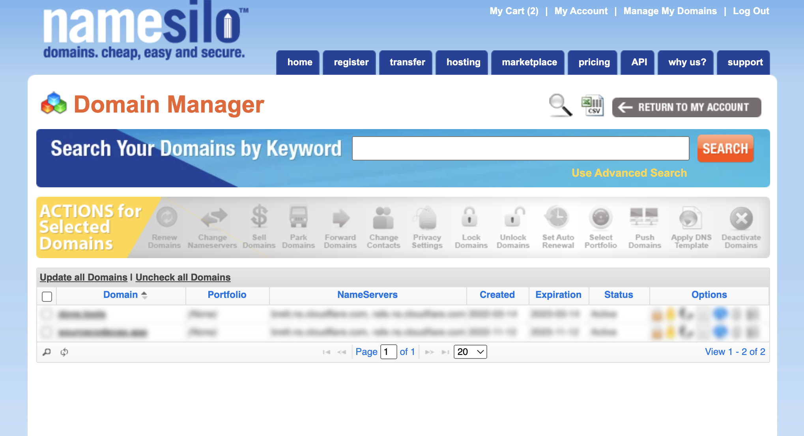
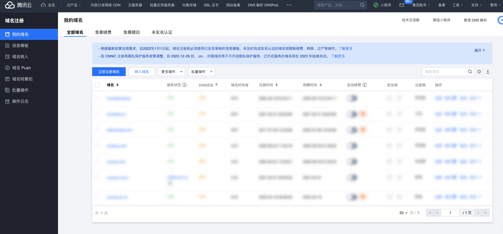

# Domain Dashboard

You only need to **copy and paste** the content of the privoder domain list page, then you will get the full domain list.

## Screenshots

## Support Domain Provider

- [Aliyun](https://dc.console.aliyun.com/#/domain-list/all)
- [CloudFlare](https://dash.cloudflare.com/)
- [NameSilo](https://www.namesilo.com/account_domains.php)
- [QCloud](https://console.cloud.tencent.com/domain/all-domain)

Copy text from the domain list, and paste it into the text file in the data directory, eg: `cloudflare.txt`.

 

 
